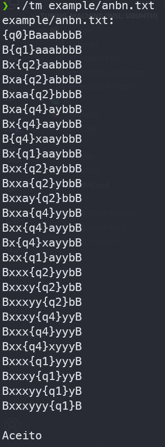

# Turing Machine

Um simulador de Maquina de Turing Determinístico Decidora de Linguagens.

## Instalar o Compilador do C++
```
$ sudo apt update
$ sudo apt install build-essential
```
## Como Compilar
```
$ cd turing-machine/
$ make all
```
## Run
```
$ ./tm Text_input.txt
```
## Rodando Com algum exemplo
```
$ ./tm exemplo/anbn.txt
```

## Exemplo do Texto_input Para o Teste
```
aaaaabbbbb
q0 a x r q1
q1 a a r q1
q1 y y r q1
q1 b y l q2
q2 a a l q2
q2 y y l q2
q2 x x r q0
q0 y y r q3
q3 y y r q3
q3 _ _ l q4
accept q4 q3
```

## Exemplo de saída para anbn (mesma quantidade de 'a' e 'b')



## Contribuições

Contribuições para este projeto são bem-vindas! Se você encontrar um bug ou tiver uma sugestão de recurso, sinta-se à vontade para abrir uma issue. Se você quiser contribuir com o código, sinta-se à vontade para abrir um Pull Request.

## Licença

Este projeto está licenciado sob a licença MIT. Veja o arquivo `LICENSE` para mais detalhes.
